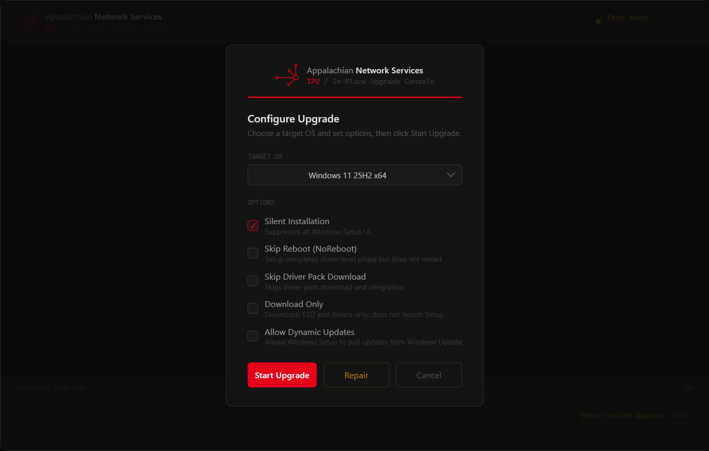
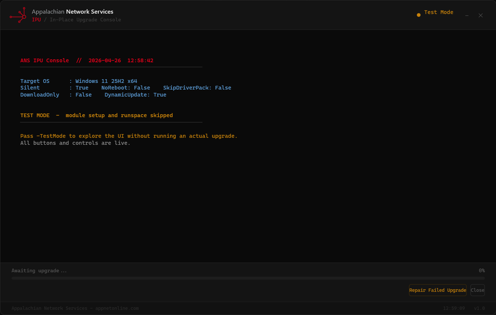

# ANS IPU Console

A WPF GUI for orchestrating Windows in-place upgrades (IPU) across managed devices, built on [OSDCloud](https://www.osdcloud.com/). Includes optional deployment telemetry via Supabase and a repair utility for failed upgrades.



---

## Features

- Dark-themed WPF config panel — choose target OS and upgrade flags before starting
- Runs `Invoke-OSDCloudIPU` in an isolated background runspace; UI never blocks
- Live progress bar (0–100%) mapped from BITS download speed and Windows Setup registry
- Supabase deployment tracking — hardware inventory, geo-IP, outcome, duration
- Repair tool for common upgrade blockers (WU reset, DISM, CBS, network stack)
- Three launch modes: local, cloud (GitHub), or self-contained EXE with embedded credentials
- `-TestMode` for UI development without admin rights or the OSD module

---

## Requirements

| Requirement | Notes |
|---|---|
| Windows 10/11 | Target and operator machine |
| PowerShell 5.1 | Built-in on Windows 10+ |
| .NET Framework 4.8 | Required for WPF |
| Admin elevation | Required for upgrade; not for `-TestMode` |
| OSD module | Auto-installed at runtime if missing |
| Internet access | Downloads ESD, driver pack, and GitHub assets |

---

## Quick Start

### Option 1 — Cloud (no local files needed)

Paste into any elevated PowerShell window:

```powershell
irm https://raw.githubusercontent.com/AppNetOnline/ans-osd-ipu/main/Start-ANSIPUGUI.ps1 | iex
```

Or double-click `Start-ANSIPUGUI.bat` — same thing, no PowerShell window required.

### Option 2 — Local clone

```powershell
git clone https://github.com/AppNetOnline/ans-osd-ipu
cd ans-osd-ipu
.\Launch-ANSIPUGUI.bat          # real run (self-elevates)
.\Launch-ANSIPUGUI-TestMode.bat # UI test — no admin or OSD needed
```

### Option 3 — Distributed EXE (credentials embedded)

Build once, distribute the EXE — no `secrets.json` needed on target machines. See [Building the EXE](#building-the-exe).

---

## Upgrade Options

The config panel lets operators set these before starting:

| Option | Default | Description |
|---|---|---|
| OS Name | Windows 11 25H2 x64 | Target OS passed to `Invoke-OSDCloudIPU -OSName` |
| Silent | On | Suppress all Windows Setup UI |
| No Reboot | Off | Complete down-level phase without restarting |
| Skip Driver Pack | Off | Skip driver pack download and integration |
| Download Only | Off | Download ESD/drivers only; do not launch Setup |
| Dynamic Update | Off | Allow Setup to pull updates from Windows Update |

---

## Supabase Deployment Tracking

Tracking is optional. When configured, every upgrade creates a row in a `deployments` table with hardware inventory, upgrade config, geo-IP, and outcome.

### 1. Create the table

Run [`shared/schema.sql`](shared/schema.sql) in the **Supabase SQL Editor** for your project. This creates the table, indexes, RLS policies, and three summary views.

### 2. Apply RLS policies

The schema includes these policies for the `anon` role:

| Policy | Operation | Condition |
|---|---|---|
| `anon_read` | SELECT | always |
| `anon_insert` | INSERT | always |
| `anon_update` | UPDATE | only rows where `status = 'Running'` |

Once a deployment is marked `Complete` or `Error` it is permanently read-only via the anon key.

### 3. Configure credentials

Copy `shared/secrets.example.json` to:

```
C:\OSDCloud\Config\Scripts\SetupComplete\secrets.json
```

Fill in your project URL and **anon (publishable) key** — not the service-role key:

```json
{
  "SupabaseUrl": "https://<project-ref>.supabase.co",
  "SupabaseKey": "<anon-publishable-key>"
}
```

> Find your anon key at **Supabase → Project Settings → API → anon public**.

### 4. Validate the setup

```powershell
cd shared
.\Test-SupabaseConnection.ps1
# Or point at your real secrets file:
.\Test-SupabaseConnection.ps1 -SecretsPath 'C:\OSDCloud\Config\Scripts\SetupComplete\secrets.json'
```

All five tests should pass. A test record is left in Supabase — delete it from the dashboard if needed.

---

## Building the EXE

`Build-ANSIPUGUI-EXE.ps1` compiles a self-contained `ANSIPUGUI.exe` with AES-256 encrypted credentials. No `secrets.json` is required on target machines.

```powershell
# Use Read-Host to keep the key out of PowerShell history
$key = Read-Host 'Supabase anon key'
.\Build-ANSIPUGUI-EXE.ps1 `
    -SupabaseUrl 'https://<ref>.supabase.co' `
    -SupabaseKey $key
```

Outputs `ANSIPUGUI.exe` in the repo root. Distribute that file — nothing else needed.

**What the EXE does at runtime:**
1. Prompts UAC (elevation embedded in manifest)
2. Decrypts credentials in memory
3. Writes a short-lived temp secrets file
4. Downloads and runs `Invoke-OSDCloudIPUGUI.ps1` from GitHub
5. Deletes the temp secrets file on exit

**Security note:** The AES-256 key and ciphertext are both in the binary. This defeats string scanning and casual inspection but not dedicated reverse engineering. For higher assurance, issue credentials from a Supabase Edge Function instead.

> `ANSIPUGUI.exe` is in `.gitignore` — do not commit it.

---

## Repair Tool

Run after a failed upgrade to fix common blockers:

```powershell
# Elevated PowerShell
.\shared\Start-Repair.ps1
```

The GUI also has a **Repair** button that launches it elevated automatically.

**What it does (10 stages):**

1. Pre-flight — disk space, pending reboot, TPM 2.0, Secure Boot, RAM
2. Clear staging — removes `$WINDOWS.~BT`, `$GetCurrent`, Panther logs
3. MoSetup registry — clears upgrade state keys and volatile setup data
4. CBS cleanup — renames `pending.xml`, resets SessionsPending, clears WER queue
5. Windows Update reset — stops services, renames `SoftwareDistribution`, re-registers 34 DLLs
6. Network/OneSettings fix — removes blocked domains from HOSTS, checks WSUS redirect
7. Network stack reset — `netsh winsock reset`, `netsh int ip reset`, DNS flush
8. Hibernation — disables if `hiberfil.sys` > 2 GB to reclaim upgrade space
9. DISM + SFC — `DISM /RestoreHealth`, `SFC /scannow`
10. Compat pre-scan — runs `Setup.exe /Compat ScanOnly` and reports hard blocks

Reboot after running, then retry the upgrade.

**Skip individual stages:**

```powershell
.\Start-Repair.ps1 -SkipPreflight -SkipNetworkReset -SkipHibernate
```

---

## File Structure

```
ans-osd-ipu/
├── gui/
│   ├── Invoke-OSDCloudIPUGUI.ps1     # Main WPF launcher
│   ├── Invoke-OSDCloudIPUDeploy.ps1  # Upgrade engine (runs in runspace)
│   └── OSDCloudIPUGUI.xaml           # Window layout (fetched from GitHub at runtime)
│
├── shared/
│   ├── SupabaseDB.psm1               # Supabase REST helpers (INSERT / UPDATE)
│   ├── schema.sql                    # Run once in Supabase SQL Editor
│   ├── secrets.example.json          # Credential template
│   ├── Start-Repair.ps1              # Post-failure repair utility
│   └── Test-SupabaseConnection.ps1   # Validate Supabase setup
│
├── Build-ANSIPUGUI-EXE.ps1           # Compile self-contained EXE
├── Start-ANSIPUGUI.ps1               # Cloud bootstrap (download + elevate)
├── Start-ANSIPUGUI.bat               # Double-click cloud launcher
├── Launch-ANSIPUGUI.bat              # Double-click local launcher (self-elevates)
└── Launch-ANSIPUGUI-TestMode.bat     # UI test without admin/OSD
```

---

## Upgrade Progress Mapping

| Phase | Source | Progress Range |
|---|---|---|
| ESD download | BITS transfer monitor | 12–52% |
| Driver pack download | BITS transfer monitor | 72–80% |
| Windows Setup | `HKLM:\...\mosetup\volatile\SetupProgress` | 87–99% |

---

## Supabase Views

Three views are created by `schema.sql` for dashboards:

| View | Description |
|---|---|
| `deployment_summary` | Count, avg duration, avg RAM grouped by status |
| `top_errors` | Most frequent error messages with occurrence count |
| `os_distribution` | Deployment count by OS target and status |

Query them with the anon key from any HTTP client or Supabase dashboard.

---

## Development

```powershell
# Test UI changes without running an actual upgrade or needing admin
.\Launch-ANSIPUGUI-TestMode.bat
```



In TestMode, the XAML and deploy script are loaded from the local `gui/` folder instead of GitHub. The upgrade runspace is never started.

Edit `$GithubBase` near the top of `Invoke-OSDCloudIPUGUI.ps1` to point at a fork or branch during development.

---

## Author

**Appalachian Network Services** — [appnetonline.com](https://appnetonline.com)
